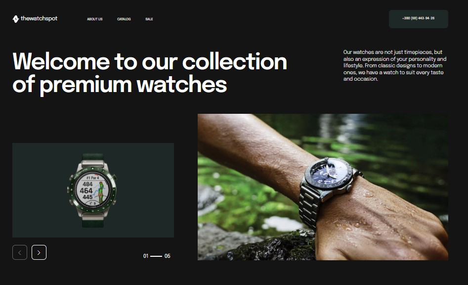
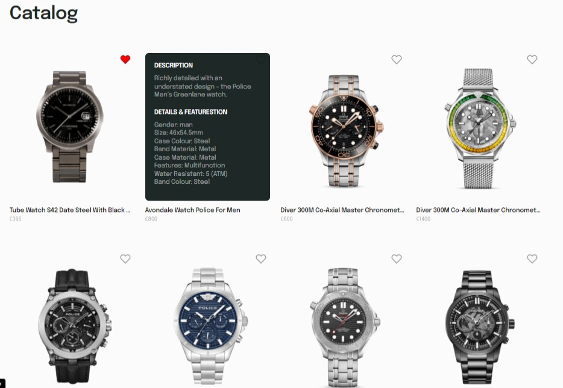

# 𝕋𝕙𝕖 𝕎𝕒𝕥𝕔𝕙 𝕊𝕡𝕠𝕥

  
   

This project was created using [Vite](https://vitejs.dev/).  
A website for watch ordering.  
Users can view a list of available watches, and mark their favorites.  
He can also check out the new products and sales.  

## 𝕋𝕒𝕓𝕝𝕖 𝕠𝕗 ℂ𝕠𝕟𝕥𝕖𝕟𝕥𝕤 ᎓  

※ [The Watch Spot](#the-watch-spot)  
※ [Features](#features)  
※ [Technologies](#technologies)  
※ [Installation](#installation)  

## 𝔽𝕖𝕒𝕥𝕦𝕣𝕖𝕤 ᎓  

※ Adaptive layout    
※ View a list of available watches  
※ Mark watches as favorites  
※ Add a watch to the shopping cart  
※ Pagination (slider) to view the list of watches  
※ Links to social media and map  

## 𝕋𝕖𝕔𝕙𝕟𝕠𝕝𝕠𝕘𝕚𝕖𝕤 ᎓  

</a>
  
※ [HTML/CSS]([https://javascript.info/](https://developer.mozilla.org/en-US/docs/Learn/Getting_started_with_the_web/HTML_basics)): create Adaptive layout and stilization.  
※ [JavaScript](https://javascript.info/): for building slider, add to cart, mark as favorite, scroll-to-top, create pop-up and hover effect.    

## 𝕀𝕟𝕤𝕥𝕒𝕝𝕝𝕒𝕥𝕚𝕠𝕟 ᎓  

To get started with this project, you can just follow the installation instructions below.

1. Clone the repository:
   ```bash
   git clone https://github.com/Morifer79/the-watch-spot.git
   cd watch-spot-app
   ```
2. Install the dependencies:
   ```bash
   npm install
   ```
4. Open to view it in the browser:  
<a href="https://djuliia.github.io/project-group-6/"></a>

## 𝔼𝕞𝕒𝕚𝕝 𝕞𝕖 ᎓  
Questions, suggestions, help:  
<a href="mailto:cyber-morifer@proton.me"></a>
   
